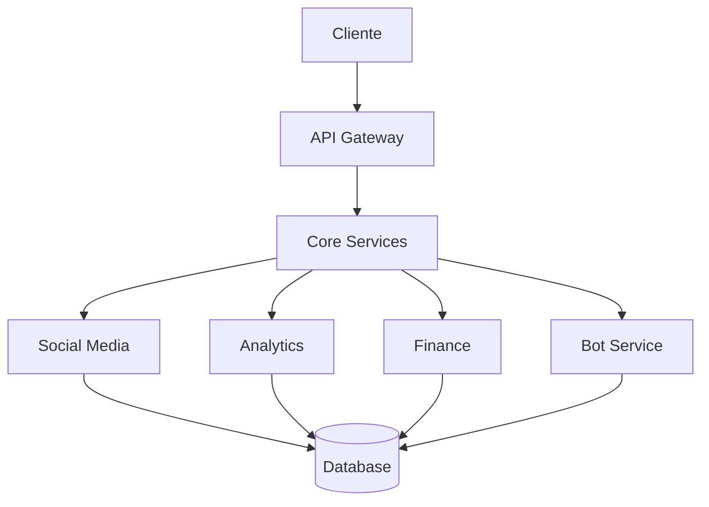

# Claude MCP Toolkit

Bem-vindo à documentação oficial do Claude MCP Toolkit! 

## 🚀 Começando

O Claude MCP Toolkit é um conjunto completo de ferramentas para desenvolvimento e automação utilizando o Claude.

### Instalação Rápida

```bash
# Clone o repositório
git clone https://github.com/Lucasdoreac/claude-mcp-toolkit.git
cd claude-mcp-toolkit

# Crie um ambiente virtual
python -m venv venv
source venv/bin/activate  # Linux/Mac
# ou
.\venv\Scripts\activate  # Windows

# Instale as dependências
pip install -r requirements.txt
```

## 💡 Exemplos Interativos

### Automação de Social Media

```python
from claude_mcp.social import SocialMediaBot

# Configurar bot
bot = SocialMediaBot({
    "platforms": ["twitter", "instagram"],
    "posting_interval": 3600
})

# Agendar post
post = {
    "content": "Exemplo de post #automation",
    "platform": "twitter",
    "schedule_time": "2025-03-01 12:00:00"
}

result = bot.schedule_post(post)
print(f"Post agendado: {result}")
```

### Dashboard Analytics

```python
from claude_mcp.analytics import DashboardBuilder
import pandas as pd

# Criar dashboard
dashboard = DashboardBuilder()

# Adicionar componentes
dashboard.add_metric_card(
    title="Usuários Ativos",
    metric="daily_users",
    compare_previous=True
)

dashboard.add_time_series(
    title="Vendas por Período",
    data_source="sales_data",
    group_by="month"
)

# Renderizar
dashboard.render()
```

## 📊 Recursos Principais

=== "Marketing Digital"
    - Automação de postagens
    - Análise de engajamento
    - Geração de relatórios
    - SEO automático

=== "Analytics"
    - Dashboards em tempo real
    - Métricas personalizadas
    - Exportação de dados
    - Alertas inteligentes

=== "Gestão Financeira"
    - Controle de receitas/despesas
    - Notas fiscais automáticas
    - Previsões financeiras
    - Relatórios gerenciais

=== "Atendimento"
    - Bot multicanal
    - Base de conhecimento
    - Análise de satisfação
    - Integrações CRM

## 🔗 Links Úteis

- [GitHub Repository](https://github.com/Lucasdoreac/claude-mcp-toolkit)
- [Exemplos Práticos](examples/)
- [Guia de Contribuição](contributing.md)
- [Comunidade](https://discord.gg/claude-mcp-toolkit)

## 📈 Diagrama de Arquitetura



## 🤝 Contribuindo

Veja nosso [Guia de Contribuição](contributing.md) para saber como participar do projeto.

## 📝 Licença

Este projeto está sob a licença MIT. Veja o arquivo [LICENSE](https://github.com/Lucasdoreac/claude-mcp-toolkit/blob/main/LICENSE.md) para mais detalhes.